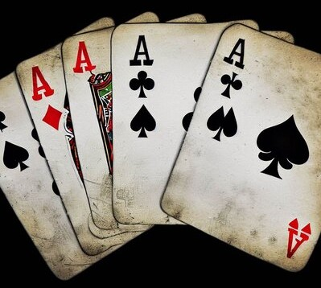

# Aces Up Strategies



## Aim

To explore which strategy (combination and order of move rules) has the best odds of winning the game of _Aces Up_.

## Ace Strategist Competition

Enter the competition and become the ultimate *Ace* by beating the odds.

Submit your best strategies and win eternal glory, respect,...and this: 🏆

[Enter the competition](https://github.com/henrikenquist/aces-up/wiki/Ace-Strategist-Competition)

# Table of contents

- [Aces Up Strategies](#aces-up-strategies)
  - [Aim](#aim)
  - [Ace Strategist Competition](#ace-strategist-competition)
- [Aces Up - The card game](#aces-up---the-card-game)
- [Example results](#example-results)
- [Terminology](#terminology)
- [Running the software](#running-the-software)
  - [Play online](#play-online)
  - [Video demo](#video-demo)
  - [Explore the unknown and reach out](#explore-the-unknown-and-reach-out)
  - [Game Plan](#game-plan)
  - [Game Center](#game-center)
  - [Single game using code](#single-game-using-code)
  - [Batch of games using code](#batch-of-games-using-code)
- [Solutions](#solutions)
- [Strategies](#strategies)
  - [Evaluation order](#evaluation-order)
  - [Rules](#rules)
  - [Strategy recommendations](#strategy-recommendations)
- [Batches](#batches)
  - [Systematic approach](#systematic-approach)
  - [Stochastic approach](#stochastic-approach)
  - [Batch recommendations](#batch-recommendations)
- [Automate strategy generation](#automate-strategy-generation)
- [Database](#database)
- [Requirements](#requirements)
- [Disclaimer](#disclaimer)
- [Regrets and refactoring](#regrets-and-refactoring)
  - [Refactoring](#refactoring)
  - [New features](#new-features)
  - [GitHub repository](#github-repository)
- [License](#license)

# Aces Up - The card game

1.  Deal four cards in a row face up.
2.  If there are two or more cards of the same suit, discard all but  
    the highest-ranked card of that suit.  
    Aces rank high.

3.  Repeat step 2 until there are no more pairs of cards with the same suit.
4.  Whenever there are any empty spaces, you may choose the top card of  
    another pile to be put into the empty space.  
    After you do this, go to Step 2.

5.  When there are no more cards to move or remove,  
    deal out the next four cards from the stack face-up onto each pile.

6.  Repeat Step 2, using only the visible, or top, cards on each of the four piles.

7.  When the last four cards have been dealt out and any moves made, the game is over.  
    The fewer cards left in the tableau, the better.  
    To win is to have only the four aces left.

When the game ends, the number of discarded cards is your score.

The maximum score (and thus the score necessary to win) is 48, which means all cards  
have been discarded except for the four aces, thus the name of the game.

Source: https://en.wikipedia.org/wiki/Aces_Up

Already tired of this game? Try some of its [variations](http://www.solitairelaboratory.com/acesup.html)!


# Example results

Since the number of unique decks is 52! (~8x10<sup>67</sup>), the number of games needed for each strategy to get a good estimate of the odds is also probably quite large. I haven't done the math, but neither did Stanislaw Ulam for the _Canfield Solitaire_ in 1946, who instead turned to John von Neumann and ran [simulations on the ENIAC](https://permalink.lanl.gov/object/tr?what=info:lanl-repo/lareport/LA-UR-88-9068) - and voilà! [Monte Carlo simulations](https://youtu.be/OgO1gpXSUzU?t=56) were born.  

The following (incomplete) table is created using game option 3 and running a session of batches with new decks and default flag settings.

Decks and moves (and more) for won games are stored in the database. Therefore it is possible to do a more rigid analysis of which strategies are best - not only looking at the odds. This kind of table doesn't paint the whole picture!

| Odds  | Strategy  | Decks   | Solutions |
| ----- | --------- | ------- | --------- |
| 84.4  | 800,200,2 | 500 000 | 5 927     |
| 121.0 | 4         | 500 000 | 4 131     |
| 150.6 | 0         | 500 000 | 3 320     |
| 176.4 | 1000      | 500 000 | 2 835     |
| 715.3 | 3         | 500 000 | 699       |
|       |           |         |           |

# Terminology

| Term     | Definition                                                               |
| -------- | ------------------------------------------------------------------------ |
| Batch    | One or many games using one or many decks and strategies                 |
| Deck     | A unique sequence of cards (i.e. a specific shuffled deck)               |
| Game     | One game of _Aces Up_ using one deck and one strategy                    |
| Move     | Defined by: [card, from_pile, to_pile, rule, move_count]                 |
| Rule     | Instruction on which card should be moved to empty pile (if possible)    |
| Session  | One or many batches using the same settings                              |
| Settings | Values of logic flags and number of new decks (or deck_ids, if selected) |
| Solution | A combination of deck and winning sequence of moves                      |
| Strategy | A sequence of rules ordered by priority                                  |

# Running the software

The most simple form of playing a game consists of one deck and the default strategy (rule 0, highest card).

The most complex form of playing involves many decks, each of which are played using each of the auto-generated strategies, which in turn are based on your custom list of rules.

The latter is the most fun but might challenge both your CPU-fans and your patience (wait for the beep, Windows only).

## Play online

Test your strategies [online](https://enquist.pythonanywhere.com/). No download needed!

## Video demo

You can watch a shortish [demo](https://youtu.be/g9ONYG44vq8) on how to run the software.

A bit more [interactive version](https://scratch.mit.edu/projects/852046666/) on Scratch.

## Explore the unknown and reach out

If that isn't enough for you, please go ahead and adapt the code to meet your needs and expand the functionality however you like (see `sandbox.py` for sample code and license below).

Feel free to [contact me](https://github.com/henrikenquist) if you have used the code and want to collaborate, share improvements or additions, report bugs, or if you have statistics from more strategies or larger batches. ...or want to buy me a coffee!

## Game Plan

- Plan, then do: design your [strategies](#strategy-recommendations) and pick a [batch approach](#batches) before doing anything large scale.

- Decide [which solutions](#solutions) to store.
  
- Systematically build the database over time to get more reliable odds.


## Game Center

In a terminal, navigate to the root folder and type: `python project.py`

```
See README for more information.

1 - Play one game with default or custom strategy 
2 - Play different strategies for one deck
3 - Play a batch or a session of batches
4 - Batch information
5 - Strategy odds       

q - Quit

Select option:
```

**WARNING** Before running batches, make sure you have the correct database activated in `project.py`!

### Using project.py

The command line user interface in `project.py` is intended to showcase the various features of the software. Not all features are available in every game option, e.g. game and strategy print-outs are disabled in options 2 and 3 in order to avoid *"console clutter"* ™.

With `project.py` you can:
- run a single game, a batch of games, or a session of batches \*
- use new deck(s) or deck(s) from a previously won game(s) \*\*
- use one strategy (default or custom) or many auto-generated strategies
- edit the default settings of the flags described in this document
- display batch information
- display a table of strategy odds

\* All batches within a session use the same settings and number of new decks (or the same deck_ids, if chosen from database).

\*\* You need to know the deck_id(s) for this feature.

Only won games from game option 3 (batch) are stored in the database.

The estimated runtime for a batch is calculated from the runtime of won games from previous batches. If the database is empty, it is set to 2 ms per game (yeah, I'm running on a laptop). For fewer than 10 stored batches, it's the mean of the batch average runtimes. For more stored batches, linear regression is used. So, the more batches you run with winning games, the more precise the estimate will be.

#### User input

In trouble? Slippery keyboard or "fat fingers"? [Don't panic!](https://en.wikipedia.org/wiki/The_Hitchhiker%27s_Guide_to_the_Galaxy_(fictional)). Instead, input one of these: "c", "e", "q", "cancel", "exit", "quit"

If you panic, press `Ctrl+C` or `Ctrl+Z` depending on OS.

You can enter a strategy (list of rules) in almost any format:

- 300 3 0
- 300,3,0
- 300-3-0
- 300/3/0
- [300 3 0]
- [300,3,0]
- ... challenge the regex if you dare!

#### Batch/session settings

Using game option 3 you can manually run multiple batches using the same or different strategies (a session). All batches in such a session use the same settings.

- If you use new decks, the same number of decks will be used for all batches in the session.

- If you choose decks from the database, these will be used for all batches in the session.

If want, you can edit the default values of the flags. I recommend that you read the documentation before doing so. Default settings shown below.

```
Edit settings (y/n): y
Use sub sets (y/n): n
Use permutations (y/n): n
Save all (y/n): y
Trust random (y/n): y
````

### Example option 1 - Play one game with custom or default strategy (0: highest card)

```
Select option: 1
Valid rules: [0, 1, 2, 3, 4, 10, 20, 30, 40, 100, 200, 300, 400, 800, 810, 900, 910, 1000]
Default strategy: 0

Select strategy ('return' for default): 1 2
-----------------------------------------
Dealing new cards
2d 5s 3c 9c    Pile size: 1 1 1 1
-----------------------------------------
9c beats 3c
2d 5s [] 9c    Pile size: 1 1 0 1
-----------------------------------------
Dealing new cards
7c Td 8d 9s    Pile size: 2 2 1 2
-----------------------------------------
Td beats 8d
7c Td [] 9s    Pile size: 2 2 0 2
CARD:   9s
RULE:   move_highest_from_highest_rank_sum
7c Td 9s 9c    Pile size: 2 2 1 1
9c beats 7c
2d Td 9s 9c    Pile size: 1 2 1 1
Td beats 2d
[] Td 9s 9c    Pile size: 0 2 1 1
CARD:   Td
RULE:   move_highest_from_highest_rank_sum
Td 5s 9s 9c    Pile size: 1 1 1 1
9s beats 5s
Td [] 9s 9c    Pile size: 1 0 1 1

(etc)

Strategy: [1, 2]
Score: 42 (48 to win)
```

### Example option 2 - Test different strategies for one deck

```
Select option: 2
Valid rules: [0, 1, 2, 3, 4, 10, 20, 30, 40, 100, 200, 300, 400, 800, 810, 900, 910, 1000]
Default strategy: 0

Select strategy ('return' for default):

Score: 45 (48 to win)

Select strategy ('return' for default): 2 1 0

Score: 36 (48 to win)

(etc)
```

### Example option 3a - Play a batch of games with a custom strategy

```
Select option: 3
Use new decks ('return') or decks from DB (input deck_ids):  
Number of decks: 100
Edit settings (y/n): n
Valid rules: [0, 1, 2, 3, 4, 10, 20, 30, 40, 100, 200, 300, 400, 800, 810, 900, 910, 1000]

Select strategy/rule list: 100 0

===========================================================
Rule list:          [100 0]
Use sub sets:       False
Permute:            False
Save all:           True
Trust random:       True
Number of games:    100
Estimated runtime:  00:00:00 (0 s / 4.49 ms)

Run batch ('return')?

===========================================================
Start time:         14:08:31
Stop time:          14:08:31
Runtime:            00:00:00  (0 s / 1.88 ms)

===========================================================
Games:              100
Decks:              100
Solutions:          0
Solved decks:       0

===========================================================
Highest score:     47
Strategy:          [100 0]
Deck nr:           23
Score distribution for 100 games:
{23: 2,
 24: 1,
 25: 1,
 26: 1,
 27: 2,
 28: 3,
 29: 3,
 30: 7,
 31: 5,
 32: 6,
 33: 3,
 34: 4,
 35: 8,
 36: 4,
 37: 6,
 38: 4,
 39: 5,
 40: 7,
 41: 6,
 42: 4,
 43: 2,
 44: 6,
 45: 7,
 46: 2,
 47: 1}

===========================================================
Rule counts for 100 games (382 moves)


[('move_highest_card', 382)]

===========================================================

Test another strategy with same settings (y/n): 
```

### Example option 3b - Play a batch of games with a auto-generated strategies

Here we go all-in and mix'match the rules like crazy - permuting all sub sets of the rule list. One use of this functionality is to test all possible strategies for one deck ("Number of decks: 1"). Can you solve **any** deck if you are clever enough? Game on!

Note: If we use a similar batch but don't allow for permutations, we get a different *type* of result. Remember that "suit below"-rules should be in front of any other rule that guarantees a move in order to be evaluated. Permutations mess that up, and consequently add misleading information to the odds table. How so, you ask?

For example: consider the rule list [1,2]. If we permute this, we get two strategies [1,2] and [2,1].
Imagine if rule 1 never moves a card, only rule 2, they both act like a strategy [2]. If we run a batch using [1,2] and [2,1], both strategies will win the same games but get separate rows in the odds table!

One option is to take care when designing your strategies and batches. Another option is to use your skills in Python, SQL, and statistics to dig deeper into the database and make sense of the mess you made (trace moves for solutions and join with strategies to get the duplicates, maybe?).

```
Select option: 3
Use new decks ('return') or decks from DB (input deck_ids):  
Number of decks: 1000
Edit settings (y/n): y
Use sub sets (y/n): y
Use permutations (y/n): y
Save all (y/n): y
Trust random (y/n): y
Valid rules: [0, 1, 2, 3, 4, 10, 20, 30, 40, 100, 200, 300, 400, 800, 810, 900, 910, 1000]

Select strategy/rule list: 800 1 0


===========================================================
Rule list:          [800, 1, 0]
Use sub sets:       True
Permute:            True
Save all:           True
Trust random:       True
Number of games:    9000
Estimated runtime:  00:00:36 (37 s / 4.07 ms)


Run batch ('return')?  

===========================================================
Start time:         09:41:57
Stop time:          09:42:26
Runtime:            00:00:29  (29 s / 3.20 ms)

===========================================================
Games:              9000
Decks:              1000
Solved decks:       22
Solutions:          66
Proportion:         6.60 % (0.066000)
Odds:               15.2

===========================================================
Solutions per deck (# in batch) for 22 of 1000 decks.


[(195, 6),
 (615, 6),
 (3, 4),
 (153, 4),
 (971, 4),
 (7, 3),
 (215, 3),
 (431, 3),
 (438, 3),
 (445, 3),
 (542, 3),
 (590, 3),
 (612, 3),
 (726, 3),
 (804, 3),
 (894, 3),
 (912, 3),
 (57, 2),
 (260, 1),
 (705, 1),
 (758, 1),
 (915, 1)]

===========================================================
Score distribution for 9000 games:
(Note: Includes potential duplicates since PERMUTE = True)


{16: 3,
 17: 6,
 19: 18,
 20: 12,
 21: 23,
 22: 36,
 23: 61,
 24: 56,
 25: 117,
 26: 152,
 27: 263,
 28: 274,
 29: 326,
 30: 339,
 31: 423,
 32: 566,
 33: 575,
 34: 570,
 35: 576,
 36: 572,
 37: 593,
 38: 582,
 39: 478,
 40: 470,
 41: 481,
 42: 390,
 43: 329,
 44: 229,
 45: 176,
 46: 109,
 47: 129,
 48: 66}

===========================================================
Rule counts for 66 solutions (578 moves)


[('move_highest_card', 369),
 ('move_highest_has_higher_in_suit_below', 113),
 ('move_from_smallest_has_higher_in_suit_below', 96)]

===========================================================
Rule counts for 9000 games (31222 moves)


[('move_highest_card', 19919),
 ('move_highest_has_higher_in_suit_below', 7000),
 ('move_from_smallest_has_higher_in_suit_below', 4303)]

===========================================================


Test another strategy with same settings (y/n):
```

### Example option 4 - Batch information

```
Select option: 4

----------------------------------------------------------------------------
batch_id       n decks     n games     runtime    avg runtime cum n decks
----------------------------------------------------------------------------

1                10000       10000        37.1         3.7         10000
2                10000       10000        17.0         1.7         20000
3                10000       10000        26.7         2.7         30000
4                10000       10000        24.5         2.4         40000
5                10000       10000        38.3         3.8         50000
6                10000       10000        16.2         1.6         60000
7                10000       10000        36.7         3.7         70000
8                10000       10000        15.9         1.6         80000
9                10000       10000        22.5         2.2         90000
10               10000       10000        20.5         2.1        100000
11               10000       10000        23.2         2.3        110000
12               10000       10000        31.2         3.1        120000
13               10000       10000        29.7         3.0        130000
14               10000       10000        23.6         2.4        140000
15               10000       10000        26.4         2.6        150000

----------------------------------------------------------------------------
batch_id       n decks     n games     runtime    avg runtime cum n decks
----------------------------------------------------------------------------
```

### Example option 5 - Strategy odds

Results from using the [stochastic approach](#stochastic-approach) (`aces_up_db.sqlite`):

- Use sub sets:       n
- Permute:            n
- Save all:           y
- Trust random:       y
- New decks:          'return'
- Number of games:    10000

Strategies run (separately): 0 1 2 3 4 10 20 30 40 100 200 300 400 1000 200,2 300,3 and 400,4

As you can see, some of the strategies didn't have any wins (but some 47 point games). More games are needed!

One interesting observation is that the random strategy does rather well, at least for this very low number of games.

You can use this approach to select candidates for larger batches, intended to produce more reliable odds.

Three databases are provided:

- `aces_up_db.sqlite` containing the batch runs described above
- `aces_up_db_production.sqlite` containing fewer rows/strategies but 500 000 games for each
- `aces_up_db_test.sqlite` for developing code, strategies, and general messing around

```
Select option: 4 

----------------------------------------------------------------------------
Odds        Strategy                                 Decks   Solutions
----------------------------------------------------------------------------

101.0       4                                        10000          99
122.0       0                                        10000          82
133.3       200,2                                    10000          75
137.0       400,4                                    10000          73
140.8       100,200,2                                10000          71
153.8       1000                                     10000          65
172.4       2                                        10000          58
238.1       300,3                                    10000          42
250.0       200                                      10000          40
250.0       400                                      10000          40
400.0       300                                      10000          25
476.2       3                                        10000          21
2500.0      1                                        10000           4
5000.0      100                                      10000           2
10000.0     10                                       10000           1

----------------------------------------------------------------------------
Odds        Strategy                                 Decks   Solutions
----------------------------------------------------------------------------
```

## Single game using code

```
from src import game, cards

deck = cards.get_new_deck()
strategy = [1, 2, 0]
GAME_PRINT_OUT = True

my_game = game.Game(deck, strategy, GAME_PRINT_OUT)
my_game.play()

print(f"Score: {my_game.score} (48 to win).")
```

## Batch of games using code

```
from src import batch

def main():
    db_name = "aces_up.sqlite"
    # Default settings
    settings = {
        "DB_NAME": db_name,
        "USE_SUB_SETS": False,
        "PERMUTE": False,
        "SAVE_ALL": True,
        "TRUST_RANDOM": True
    }

    batch.run(**settings)

if __name__ == "__main__":
    main()
```

Note: Print-outs increase runtime. Especially GAME_PRINT_OUT, which also clutters the output for batch runs.

# Solutions

A game can be won by one or many solutions. You definitely want to store all of those.

A solution can be the result of different strategies, since the same sequence of moves can result from different sets of rules. In other words, the cards have been moved in the same order but for different reasons.

So, what do you want to store? A solution to a game regardless of how it was achieved, or information on which strategy had that solution (resulting in potential "duplicate" solutions)? Is your head spinning yet?

### Fun with flags

Per default, these "duplicates" are stored (the flag `SAVE_ALL` == `True`). That is, the link between a solution and a strategy is stored in the `solutions` table for all won games (when running batches), even if another strategy already has stored the same solution in the database. This is in line with the aim of the project.

It is possible avoid that behaviour when running a batch (Edit settings (y/n)? y -> Save all (y/n)? n). Then, links between a solution and new strategies winning a game are not stored if a solution is previously stored by another strategy for that game (note: that strategy gets all the credit in the odds!).

This could be handy if you want to explore the odds of winning a game of _Aces Up_ **at all** using your strategies. ... but the strategy odds will be messed up.

🚩 On the other hand, if you're waving carelessly with the flags you might end up with something like:

```
Select option: 3
Use new decks ('return') or decks from DB (input deck_ids):  1
Edit settings (y/n): y
Use sub sets (y/n): y
Use permutations (y/n): y
Save all (y/n): n
Trust random (y/n): n
```

Firstly, there is no sense in using sub sets or permutations for a single rule.

Secondly, setting the `SAVE_ALL` flag to `FALSE` for a deck you **know** has a solution might give you confusing (but correct) results. Here we have two won games but no solutions (since we redefined the meaning of a "solution" by altering the flag, remember?). Think of the `SAVE_ALL` flag as "ALSO_SAVE_SAME_SOLUTION_BUT_FROM_NEW_STRATEGIES". How about that as a variable name (Pylint disapproves)?

```
===========================================================
Games:              3
Decks:              1
Solved decks:       0
Solutions:          0

===========================================================
Highest score:     48
Strategy:          (100, 0)
Deck nr:           1
Score distribution for 3 games:
(Note: Includes potential duplicates since PERMUTE = True)

{31: 1, 48: 2}
```

# Strategies

## Evaluation order

Rules in a strategy are evaluated in order.

Examples of different strategies:

- strategy A = [200, 2]
- strategy B = [2, 200]

After a deal (and following discards), rules are evaluated from the beginning of the list. As soon as a move has been made according to a rule, trailing rules in the strategy are ignored (i.e. never evaluated) during that particular round. Thus, e.g. duplication of a rule in a strategy doesn't change the outcome of the strategy.

Example:

- strategy = [2, 200]
- rule 200 is never reached since 2 always guarantees a move (if a move is possible).

## Rules

The rules are implemented in `strategy.py`.

A rule moves a card from the leftmost pile if more than one card matches the rule.

Moves are only made from piles larger than one card.

| Rule                   | Move ...                                                   |
| ---------------------- | ---------------------------------------------------------- |
| Default                |                                                            |
| 0                      | ... highest card from any pile                             |
| Highest card           |                                                            |
| 1 *                    | ... highest card with card of same suit below              |
| 2                      | ... highest card from pile with largest card sum           |
| 3                      | ... highest card from smallest pile                        |
| 4                      | ... highest card from largest pile                         |
| Lowest card            |                                                            |
| 10 *                   | ... lowest card with card of same suit below               |
| 20                     | ... lowest card from pile with largest card sum            |
| 30                     | ... lowest card from smallest pile                         |
| 40                     | ... lowest card from largest pile                          |
| Ace                    |                                                            |
| 100 *                  | ... ace with card of same suit below                       |
| 200                    | ... ace from pile with largest card sum                    |
| 300                    | ... ace from smallest pile                                 |
| 400                    | ... ace from largest pile                                  |
| Pile size & suit below |                                                            |
| 800 *                  | ... from smallest pile with higher card of same suit below |
| 810 *                  | ... from smallest pile with lower card of same suit below  |
| 900 *                  | ... from largest pile with higher card of same suit below  |
| 910 *                  | ... from largest pile with lower card of same suit below   |
| Random                 |                                                            |
| 1000                   | ... card from random pile                                  |
|                        |                                                            |

\* Rules 1, 10, 100, 800, 810, 900, and 910 don't guarantee a move.

### A friendly conversation

A player might say:

> "Hey dude, the _Ace_ rule moves are covered by the _Highest card_ rules so why not only use those?"

I reply:

> "That is correct, my friend. But! What if you want to test a strategy where you only want to move the aces, but not the highest card (if not an ace)?"

The player is not convinced:

> "Why would you want to do that? Isn't that stupid? Don't you want to win the game?"

I explain:

> "Well remember, the aim of this software is to test different strategies, so this is a feature - not a bug.
>
> Run game option 2, first with rule 3 and then with rule 30. You will see that you (sometimes) get different scores!
>
> By the way, only allowing for ace moves is a known variation which is harder to win. Don't you like a challenge?

[Aces Up variations](https://en.wikipedia.org/wiki/Aces_Up#Variations)

### Missing rules

The list above is by no means exhaustive. I can think of other rules I would like to include, but haven't had the time to do. Maybe you can do it and send a pull request?

Some examples of additional (and in hindsight, obvious) rule concepts could be:

Example A
- move the highest card which reveals the **lowest** card of the same suit
- move the lowest card which reveals the **highest** card of the same suit

This concept could prioritize elimination of lower cards better than the existing rules. The same idea goes for the other classes of rules as well.

Example B
- only move cards higher/lower than a certain rank, e.g. nine

If you want more tips on new rules, see `/info/rule_versions.md`.


## Strategy recommendations

I would recommend that you design your strategy based on the following principles:

1. Place any *Ace* rule before any *Highest card* rule.
2. Place any *Suit below* (\*) rule before any other corresponding rule.
3. Add a rule that guarantees a move somewhere after *Suit below* rule (\*).
4. Finally, be creative but clever.
   
Remember:

- Rule evaluation starts with the first rule after each deal/discard.
- The rule order is rearranged when using `PERMUTE`, so the original order of rules in the strategy doesn't matter (that's why it's called *Strategy/rule list* in the batch run).
- More rules in a strategy is **not** necessarily better.

Generally:
- Good form: 1 2
- Bad form: 2 1
- Good form: 300 3
- Bad form: 3 300
- Really bad form: 0 1 2 3 4 10 20 30 40 100 200 300 400 800 810 900 910 1000 \*
- Best form? Well, that is what it's all about. You tell me!

\* Well, it is meaningful when using `USE_SUB_SETS` and/or `PERMUTE` in batches, e.g. if you want to run a really big batch (see *Number of games* below).

# Batches

A batch consists of nested for loops:

- for each deck
  - for each strategy
    - play game

There are two approaches towards randomness when testing various strategies with batches - "systematic" and "stochastic".

## Systematic approach

This approach considers the fact that if one strategy has won a game, another (similar) strategy will have a higher chance of winning that particular game - especially if the rule list is well-designed. In that sense, there is less randomness involved. Since all strategies (created by `USE_SUB_SETS` and/or `PERMUTE`) use the same decks in a batch, the resulting odds are misleading if the number of decks is low.

This approach is suitable when comparing strategies for a given set of decks, or for *mega-batches* ™. 

Workflow:
1. Test **many** strategies for **many** deck(s)
2. Repeat 1 using the same strategies
3. Test new strategies using **the same** decks as in 1 and 2 (via the deck_id) and the same **total number** of decks

Note: The flag `TRUST_RANDOM` is automatically set to `False` if `USE_SUB_SETS` or `PERMUTE` == `True` [(info)](#stochastic-approach).

Select game option 3 to run steps 1 and 2, with these settings:

- Use sub sets (y/n)? y or n
- Use permutations (y/n)? y or n
- Save all (y/n)? y or n
- Trust random (y/n)? n
- Use new decks ('return') or decks from DB (input deck_ids):
- Number of decks: choose reasonably

Select game option 3 to run step 3, with these settings:

- Use sub sets (y/n)? y or n
- Use permutations (y/n)? y or n
- Save all (y/n)? y or n
- Trust random (y/n)? n
- Use new decks ('return') or decks from DB (input deck_ids): deck_ids from **all** previous batches
- Number of decks: **total** number of decks for previous strategy

Yes, I said it was systematic. Keep a log!

Tip: You might want to write code to fetch the deck_ids. I forgot that bit.

It should be straightforward to do and be based on joining the table `solutions` and `decks` according to the strategies generated by the batch settings. Send me a pull request when you're done.

## Stochastic approach

This approach is more happy-go-lucky and relies on the `shuffle` function in Python to deliver randomness correctly. If it does, it is unlikely that two games are played using the same deck (one in ~8x10<sup>67</sup>). Comparing the odds of different strategies then relies on statistics and for that you need **equally** many games for each strategy.

One advantage with this approach is that you can speed things up a little (only decks for won games are checked) by trusting the decks are "always" unique. Per default, the flag `TRUST_RANDOM` is set to `True` (i.e. don't check if deck is already in database). It is possible avoid that behaviour when running a batch (Edit settings (y/n)? y -> Trust random (y/n)? n)

Workflow:
1. Test **one** strategy for **many** decks
2. Repeat 1 using the same or another strategy
3. Keep track of the total number of games played by each strategy

Select game option 3 to run steps 1 and 2:

- Edit settings (y/n): n
- Use new decks ('return') or decks from DB (input deck_ids):
- Number of decks: choose reasonably

Continue the session after the batch is finished:

- Test another strategy with same settings (y/n): y

Easier and better, right? But what if you want to test new strategies on the same decks? Let's go systematic!

## Batch recommendations

- Use a separate database for each approach! They don't play nice.

- Make sure each strategy has played the same number of games, e.g. by always using the same number of decks for each batch  (see game option 4, the `batches` table, or sample code in `sandbox.py`). Otherwise the odds can't be reliably compared across strategies.

- Use the same value of the flags `SAVE_ALL` and `TRUST_RANDOM` for a specific database.

# Automate strategy generation

Strategies can be generated automatically from a given rule list. All these generated strategies are then used in the batch run. This is a convenient way to test multiple strategies for any given deck and see if it is possible to win that particular game at all.

The optimal solution would be a recursive algorithm, but that is practically only possible for a very limited number of rules in a strategy due to memory restrictions. At least on my crappy old laptop.

The two settings can be used in combination. If both are `True`, all subsets of rule list are permuted.

### USE_SUB_SETS

Run games for all subsets of rule list.

[1,20,300] -> [ [1], [1,20], [1,20,300] ]

### PERMUTE

Run games for all permutations of rule list.

[1,20,300] -> [ [1,20,300], [1,300,20], [300,1,20], [20,1,300], [20,300,1], [300,20,1] ... ]

### Number of games

For one deck and n rules:

| Setting             | Number of games                |
| ------------------- | ------------------------------ |
| USE_SUB_SETS = True | n                              |
| PERMUTE = True      | n!                             |
| Both = True         | n! + (n-1)! + (n-2)! + ... + 1 |
|                     |                                |

Example:

- `USE_SUB_SETS` = `True`
- `PERMUTE` = `True`
- 18 rules (i.e. all implemented rules)
- -> ~6.78<sup>15</sup> [games for each deck](https://www.symbolab.com/solver/induction-calculator/solve%20for%20%5Csum_%7Bn%3D1%7D%5E%7B18%7D%20%5Cleft(n%5Cright)!?or=input).

# Database

You can use [DB Browser](https://sqlitebrowser.org/) or similar to inspect and manipulate databases (fix things that went haywire).

| Table      |             |                                     |
| ---------- | ----------- | ----------------------------------- |
| Batches    | batch_id    | INTEGER UNIQUE NOT NULL PRIMARY KEY |
|            | n_decks     | INTEGER                             |
|            | rule_list   | TEXT                                |
|            | permute     | INTEGER                             |
|            | sub_sets    | INTEGER                             |
|            | n_games     | INTEGER                             |
|            | runtime     | REAL                                |
| Decks      |             |                                     |
|            | deck_id     | INTEGER UNIQUE NOT NULL PRIMARY KEY |
|            | cards       | TEXT                                |
| Moves      |             |                                     |
|            | moves_id    | INTEGER UNIQUE NOT NULL PRIMARY KEY |
|            | moves_str   | TEXT                                |
|            | rule_counts | TEXT                                |
| Solutions  |             |                                     |
|            | solution_id | INTEGER UNIQUE NOT NULL PRIMARY KEY |
|            | deck_id     | INTEGER                             |
|            | moves_id    | INTEGER                             |
|            | strategy_id | INTEGER                             |
|            | batch_id    | INTEGER                             |
| Strategies |             |                                     |
|            | strategy_id | INTEGER UNIQUE NOT NULL PRIMARY KEY |
|            | rule_list   | TEXT                                |
|            |             |                                     |

Yes, `rule_list` is duplicated in the `batches` table instead of using the obvious `strategy_id`. This is probably due to some old hack I had to conjure up in the beginning when I didn't know better. So shoot me! ...or rather, fix it and send a pull request.

...and how do you think I felt when I realized there is an `AUTO_INCREMENT` in sqlite? Happy of course, since then I get to refactor more - later. Yeay!

# Requirements

This software is written in [Python](https://www.python.org/downloads/). You need to install that to be able to play _Aces Up_.

### Modules

Imported modules are listed in `requirements.txt`.

- Running _Aces Up Strategies_ via `project.py` requires **no** installation of additional modules.

- Running `test_project.py` requires `pytest` and dependencies.
  
So, why the long requirement list?

- I installed `pytest` and got a lot of "bonus" modules (dependencies).
  
- I also installed `matplotlib` and `numpy` for plotting runtimes in `sandbox.py` (I like pretty pictures). These modules, and their dependencies, are not used by `project.py`.

Windows users will hear a beep when a batch run is finished (using the `winsound` module). Users on other platforms will have to stare at the screen for hours on end to know when their *mega-batches* ™ are done. If you experience a `ModuleNotFoundError`, this might be why (although I wrapped the bloody thing in try-except blocks).

### Write permission

When using batches (running and extracting statistics), an sqlite database is required. It is created when running the first batch and updated for consecutive batch runs. The name of the database is set in `project.py` and `sandbox.py` respectively (depending on the way you choose to run the software).


Please take care to "activate" the correct db before running the program. You will thank yourself later...

# Disclaimer

This is my first Python project ever and I've been using _Aces Up Strategies_ as a way to learn the Python language itself, various related conventions and styles, Markdown, sqlite, git, pip, virtual environments, VSCode, extensions, deployment on pythonanywhere, and so forth - quite a mouthful. In order to not overextend myself, I let an AI create the logo.

Therefore, it is by no means the most elegant, efficient and "pythonic" code out there. Rather, it's a playground and hopefully an incrementally less messy learning experiment (which might be reflected in the code evolution as seen in the commits). One upside is that there is plenty of room for improvement!

As always, the TODO-list will perservere...

### Not happy?

If you're not happy with my thing, there are other Aces Up solvers out there:

[This one](https://github.com/jwnorman/aces-up) includes odds/proportion distribution for scores. Seems to use logic similar to strategy = [200, 2].

- n decks: 4 000 000
- proportion: 0.007057
- odds: 141.7

A recursive(?) [OO-styled implementation](https://github.com/magnusbakken/aces-up) 

# Regrets and refactoring

Would I design the software the same way again? No, certainly not. Game logic is convoluted, code is overly complicated, and the software design follows the infamous *"...but it works"* ™ pattern. Also, I have learned things along the way, things which would have been helpful at the beginning of the project but were more akin to magic at the time. 

Any regrets? No, nothing that can't be fixed by refactoring!

If I would do this again, I might aim for a recursive algorithm and run sessions of batches. I know enough now to do that, but since I started this project before I knew anyting it became the unwieldly beast it is.

Lessons learned? First of all, I would **plan** things before starting to type. Think, then do!

So, what about the future?  

## Refactoring

- optimize the code; running large batches on an old laptop takes time, and energy is at a premium in this day and age
- use a more object-oriented approach, which is obvious in hindsight
- create a design which facilitates easy addition of new rules
- make the code more "pythonic" and less verbose
- delegate logging/print-outs and timers to decorators
- update `/info/todo.txt` - it's so old it knew dinosaurs on a first name basis
- (use a database framework such as SQLAlchemy)
- ... and the list goes on

## New features

- web based user interface
- support for more visual, interactive, and user friendly statistics output
- present game output graphically (e.g. display card images when playing a game)
- re-play a previous won game at "human speed"
- let the user set the default strategy and other settings (stored in db, text file, or cookie)
- ... see you in CS50X and CS50W 😉

Actually let the user play the game manually? I guess some of you just wanted that.

There are **so** many implementations out on the interweb that I can't be bothered making yet another one.

I made something else instead. It was fun!

## GitHub repository

Download, contribute, and join the community.

*Aces Up Strategies* [repository on GitHub](https://github.com/henrikenquist/aces-up)

# License

[MIT License](https://mit-license.org/)

Copyright (c) 2023 Henrik Enquist (GitHub: [henrikenquist](https://github.com/henrikenquist))

Permission is hereby granted, free of charge, to any person obtaining a copy of this software and associated documentation files (the “Software”), to deal in the Software without restriction, including without limitation the rights to use, copy, modify, merge, publish, distribute, sublicense, and/or sell copies of the Software, and to permit persons to whom the Software is furnished to do so, subject to the following conditions:

The above copyright notice and this permission notice shall be included in all copies or substantial portions of the Software.

THE SOFTWARE IS PROVIDED “AS IS”, WITHOUT WARRANTY OF ANY KIND, EXPRESS OR IMPLIED, INCLUDING BUT NOT LIMITED TO THE WARRANTIES OF MERCHANTABILITY, FITNESS FOR A PARTICULAR PURPOSE AND NONINFRINGEMENT. IN NO EVENT SHALL THE AUTHORS OR COPYRIGHT HOLDERS BE LIABLE FOR ANY CLAIM, DAMAGES OR OTHER LIABILITY, WHETHER IN AN ACTION OF CONTRACT, TORT OR OTHERWISE, ARISING FROM, OUT OF OR IN CONNECTION WITH THE SOFTWARE OR THE USE OR OTHER DEALINGS IN THE SOFTWARE.
